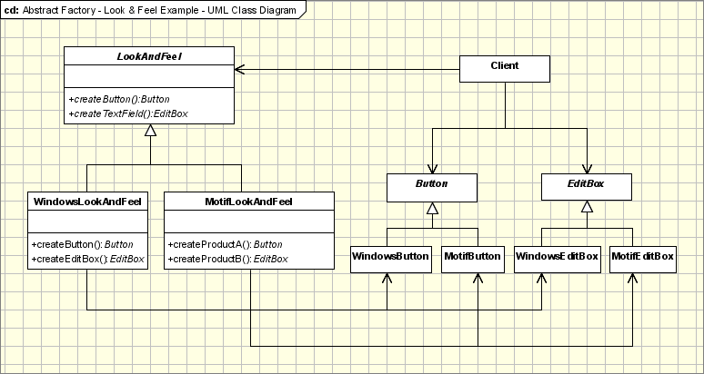

## [抽象工厂模式](https://www.oodesign.com/abstract-factory-pattern.html)

[^_^]: ## Abstract Factory--!>

### 动机

[^_^]: ### Motivation --!>

模块化是当今编程中的一个大问题。世界各地的程序员都试图避免将代码添加到现有类中的想法，以使它们支持封装更多的一般信息。以管理电话号码的信息管理员为例。电话号码具有特定的规则，根据地区和国家/地区生成它们。如果在某些时候应该更改应用程序以支持从新国家/地区添加数字，则应用程序的代码将不得不更改并且将变得越来越复杂。
[^_^]: Modularization is a big issue in today's programming. Programmers all over the world are trying to avoid the idea of adding code to existing classes in order to make them support encapsulating more general information. Take the case of a information manager which manages phone number. Phone numbers have a particular rule on which they get generated depending on areas and countries. If at some point the application should be changed in order to support adding numbers form a new country, the code of the application would have to be changed and it would become more and more complicated.--!>

为了防止它，使用抽象工厂设计模式。使用此模式定义框架，该框架生成遵循一般模式的对象，并且在运行时，此工厂与任何具体工厂配对，以生成遵循特定国家/地区模式的对象。换句话说，抽象工厂是一个超级工厂，它创建了其他工厂（工厂继承工厂）。
[^_^]: In order to prevent it, the Abstract Factory design pattern is used. Using this pattern a framework is defined, which produces objects that follow a general pattern and at runtime this factory is paired with any concrete factory to produce objects that follow the pattern of a certain country. In other words, the Abstract Factory is a super-factory which creates other factories (Factory of factories).--!>

### 意图
[^_^]: ### Intent--!>

抽象工厂提供了用于创建一系列相关对象的接口，而无需显式指定其类。
[^_^]: Abstract Factory offers the interface for creating a family of related objects, without explicitly specifying their classes.--!>

### 实现
[^_^]: ### Implementation--!>

该模式基本上如下所示，在UML图中：
[^_^]: The pattern basically works as shown below, in the UML diagram:--!>


[^_^]: Abstract Factory Implementation - UML Class Diagram --!>

参与抽象工厂模式的类是：
[^_^]: The classes that participate to the Abstract Factory pattern are:--!>
[^_^]: AbstractFactory - declares a interface for operations that create abstract products.--!>
[^_^]: ConcreteFactory - implements operations to create concrete products.--!>
[^_^]: AbstractProduct - declares an interface for a type of product objects.--!>
[^_^]: Product - defines a product to be created by the corresponding ConcreteFactory; it implements the AbstractProduct interface.--!>
[^_^]: Client - uses the interfaces declared by the AbstractFactory and AbstractProduct classes.--!>

* AbstractFactory——为创建抽象产品的操作声明一个接口。
* ConcreteFactory——实现创建具体产品的操作。
* AbstractProduct——为一类产品对象声明一个接口。
* Product——定义由相应的ConcreteFactory创建的产品; 它实现了AbstractProduct接口。
* 客户端——使用AbstractFactory和AbstractProduct类声明的接口。

AbstractFactory类是确定具体对象的实际类型并创建它的类，但它返回一个指向刚刚创建的具体对象的抽象指针。这决定了客户端的行为，该客户端要求工厂创建某个抽象类型的对象并将抽象指针返回给它，从而使客户端不知道有关该对象的实际创建的任何信息。
[^_^]: The AbstractFactory class is the one that determines the actual type of the concrete object and creates it, but it returns an abstract pointer to the concrete object just created. This determines the behavior of the client that asks the factory to create an object of a certain abstract type and to return the abstract pointer to it, keeping the client from knowing anything about the actual creation of the object.--!>

工厂返回指向创建对象的抽象指针的事实意味着客户端不知道对象的类型。这意味着不需要包含任何与具体类型相关的类声明，客户端始终使用抽象类型进行处理。由工厂创建的具体类型的对象仅由客户端通过抽象接口访问。
[^_^]: The fact that the factory returns an abstract pointer to the created object means that the client doesn't have knowledge of the object's type. This implies that there is no need for including any class declarations relating to the concrete type, the client dealing at all times with the abstract type. The objects of the concrete type, created by the factory, are accessed by the client only through the abstract interface.--!>

这种创建对象的方式的第二个含义是，当需要添加新的具体类型时，我们所要做的就是修改客户端代码并使其使用不同的工厂，这比实例化新类型要容易得多，这需要在创建新对象的任何位置更改代码。
[^_^]: The second implication of this way of creating objects is that when the adding new concrete types is needed, all we have to do is modify the client code and make it use a different factory, which is far easier than instantiating a new type, which requires changing the code wherever a new object is created.--!>

抽象工厂模式的经典实现如下：
[^_^]: The classic implementation for the Abstract Factory pattern is the following:--!>

```java
abstract class AbstractProductA{
	public abstract void operationA1();
	public abstract void operationA2();
}

class ProductA1 extends AbstractProductA{
	ProductA1(String arg){
		System.out.println("Hello "+arg);
	} // Implement the code here
	public void operationA1() { };
	public void operationA2() { };
}

class ProductA2 extends AbstractProductA{
	ProductA2(String arg){
		System.out.println("Hello "+arg);
	} // Implement the code here
	public void operationA1() { };
	public void operationA2() { };
}

abstract class AbstractProductB{
	//public abstract void operationB1();
	//public abstract void operationB2();
}

class ProductB1 extends AbstractProductB{
	ProductB1(String arg){
		System.out.println("Hello "+arg);
	} // Implement the code here
}

class ProductB2 extends AbstractProductB{
	ProductB2(String arg){
		System.out.println("Hello "+arg);
	} // Implement the code here
}

abstract class AbstractFactory{
	abstract AbstractProductA createProductA();
	abstract AbstractProductB createProductB();
}

class ConcreteFactory1 extends AbstractFactory{
	AbstractProductA createProductA(){
		return new ProductA1("ProductA1");
	}
	AbstractProductB createProductB(){
		return new ProductB1("ProductB1");
	}
}

class ConcreteFactory2 extends AbstractFactory{
	AbstractProductA createProductA(){
		return new ProductA2("ProductA2");
	}
	AbstractProductB createProductB(){
		return new ProductB2("ProductB2");
	}
}

//Factory creator - an indirect way of instantiating the factories
class FactoryMaker{
	private static AbstractFactory pf=null;
	static AbstractFactory getFactory(String choice){
		if(choice.equals("a")){
			pf=new ConcreteFactory1();
		}else if(choice.equals("b")){
				pf=new ConcreteFactory2();
			} return pf;
	}
}

// Client
public class Client{
	public static void main(String args[]){
		AbstractFactory pf=FactoryMaker.getFactory("a");
		AbstractProductA product=pf.createProductA();
		//more function calls on product
	}
}
```

### 适用性和示例
[^_^]: ### Applicability & Examples--!>

我们应该在以下情况下使用抽象工厂设计模式：
[^_^]: We should use the Abstract Factory design pattern when:--!>
[^_^]: the system needs to be independent from the way the products it works with are created.--!>
[^_^]: the system is or should be configured to work with multiple families of products.--!>
[^_^]: a family of products is designed to work only all together.--!>
[^_^]: the creation of a library of products is needed, for which is relevant only the interface, not the implementation, too.--!>

* 系统需要独立于其使用的产品的创建方式。
* 系统已配置或应配置为与多个产品系列配合使用。
* 一系列产品旨在一起工作。
* 需要创建产品库，其中仅与接口有关，而与实现无关。


#### 电话号码示例
[^_^]: #### Phone Number Example--!>

本文开头的示例也可以扩展到电话号码地址。AbstractFactory类将包含在信息管理器中为电话号码和地址创建新条目的方法，这些方法生成属于AbstractProduct类的抽象产品Address和PhoneNumber。AbstractProduct类将定义这些产品支持的方法：用于街道，城市，地区和邮政编码成员的地址获取和设置方法，以及电话号码获取和设置数字的方法。
[^_^]: The example at the beginning of the article can be extended to addresses, too. The AbstractFactory class will contain methods for creating a new entry in the information manager for a phone number and for an address, methods that produce the abstract products Address and PhoneNumber, which belong to AbstractProduct classes. The AbstractProduct classes will define methods that these products support: for the address get and set methods for the street, city, region and postal code members and for the phone number get and set methods for the number.--!>

ConcreteFactory和ConcreteProduct类将实现上面定义的接口，并将以USAddressFactory类和USAddress和USPhoneNumber类的形式出现在我们的示例中。对于需要添加到应用程序的每个新国家/地区，将添加一组新的具体类型。这样我们可以将EnglandAddressFactory和EnglandAddress以及EnglandPhoneNumber作为英文地址信息的文件。
[^_^]: The ConcreteFactory and ConcreteProduct classes will implement the interfaces defined above and will appear in our example in the form of the USAddressFactory class and the USAddress and USPhoneNumber classes. For each new country that needs to be added to the application, a new set of concrete-type classes will be added. This way we can have the EnglandAddressFactory and the EnglandAddress and EnglandPhoneNumber that are files for English address information.--!>


#### 披萨工厂的例子
[^_^]: #### Pizza Factory Example--!>

另一个例子是比萨工厂，这次更简单，更容易理解，它定义方法名称并返回类型以制作不同种类的比萨饼。抽象工厂可以命名为AbstractPizzaFactory，RomeConcretePizzaFactory和MilanConcretePizzaFactory是抽象类的两个扩展。抽象工厂将定义比萨饼的浇头类型，如意大利辣香肠，香肠或凤尾鱼，而ConcreteFactory将只实施一组特定于该区域的浇头，即使在两个ConcreteFactory中实施了一个浇头，由此产生的比萨将是不同的子类，每个子类都用于它所实现的区域。
[^_^]: Another example, this time more simple and easier to understand, is the one of a pizza factory, which defines method names and returns types to make different kinds of pizza. The abstract factory can be named AbstractPizzaFactory, RomeConcretePizzaFactory and MilanConcretePizzaFactory being two extensions of the abstract class. The abstract factory will define types of toppings for pizza, like pepperoni, sausage or anchovy, and the concrete factories will implement only a set of the toppings, which are specific for the area and even if one topping is implemented in both concrete factories, the resulting pizzas will be different subclasses, each for the area it was implemented in.--!>


#### 外观和感觉的例子
[^_^]: #### Look & Feel Example--!>

外观和感觉抽象工厂是最常见的例子。例如，GUI框架应该支持多个外观主题，例如Motif和Windows外观。每种样式为每种类型的控件定义不同的外观和行为：按钮和编辑框。为了避免对每种类型的控件进行切割，我们定义了一个抽象类LookAndFeel。此调用将实例化，具体取决于应用程序中的一个配置参数具体工厂：WindowsLookAndFeel或MotifLookAndFeel。每个对新对象的请求都将委托给instatiated具体工厂，该工厂将返回具有特定风格的控件。

[^_^]: Look & Feel Abstract Factory is the most common example. For example, a GUI framework should support several look and feel themes, such as Motif and Windows look. Each style defines different looks and behaviors for each type of controls: Buttons and Edit Boxes. In order to avoid the hardociding it for each type of control we define an abstract class LookAndFeel. This calls will instantiate, depending on a configuration parameter in the application one of the concrete factories: WindowsLookAndFeel or MotifLookAndFeel. Each request for a new object will be delegated to the instatiated concrete factory which will return the controls with the specific flavor--!>


[^_^]: Abstract Factory Example - UML Class Diagram --!>

### 具体问题和实现
[^_^]: ### Specific problems and implementation--!>

抽象工厂模式既有优点和缺点。它将对象的创建与需要它们的客户端隔离开来，使客户端只能通过接口访问它们，这使得操作更容易。产品系列的切换更容易，因为具体工厂的类只出现在代码中的实例化。此外，如果一个系列的产品要一起工作，抽象工厂可以让您一次只使用一个物品。另一方面，将新产品添加到现有工厂很困难，因为Abstract Factory界面使用可以创建的固定产品集。这就是为什么添加新产品意味着扩展工厂接口，这涉及AbstractFactory类及其所有子类的更改。
[^_^]: The Abstract Factory pattern has both benefits and flaws. On one hand it isolates the creation of objects from the client that needs them, giving the client only the possibility of accessing them through an interface, which makes the manipulation easier. The exchanging of product families is easier, as the class of a concrete factory appears in the code only where it is instantiated. Also if the products of a family are meant to work together, the Abstract Factory makes it easy to use the objects from only one family at a time. On the other hand, adding new products to the existing factories is difficult, because the Abstract Factory interface uses a fixed set of products that can be created. That is why adding a new product would mean extending the factory interface, which involves changes in the AbstractFactory class and all its subclasses. This section will discuss ways of implementing the pattern in order to avoid the problems that may appear.--!>


#### 工厂单例
[^_^]: #### Factories as singletons--!>

应用程序通常只需要每个系列产品的一个ConcreteFactory类实例。这意味着最好将其实现为单例模式。
[^_^]: An application usually needs only one instance of the ConcreteFactory class per family product. This means that it is best to implement it as a Singleton.--!>


#### 创建产品
[^_^]: #### Creating the products--!>

AbstractFactory类仅声明用于创建产品的接口。ConcreteProduct类的任务是实际创建产品。对于每个系列，最好的想法是应用工厂方法设计模式。具体工厂将通过覆盖每个工厂的工厂方法来指定其产品。即使实现看似简单，使用这个想法也意味着为每个产品系列定义一个新的具体工厂子类，即使这些类在大多数方面是相似的。
[^_^]: The AbstractFactory class only declares the interface for creating the products. It is the task of the ConcreteProduct class to actually create the products. For each family the best idea is applying the Factory Method design pattern. A concrete factory will specify its products by overriding the factory method for each of them. Even if the implementation might seem simple, using this idea will mean defining a new concrete factory subclass for each product family, even if the classes are similar in most aspects.--!>

为了简化代码并提高性能，可以使用原型设计模式而不是工厂方法设计模式，尤其是当有许多产品系列时。在这种情况下，ConcreteFactory以系列中每个产品的原型实例启动，当需要新产品而不是创建它时，克隆现有原型。这种方法消除了为每个新系列产品建立ConcreteFactory的需要。
[^_^]: For simplifying the code and increase the performance the Prototype design pattern can be used instead of Factory Method, especially when there are many product families. In this case the concrete factory is initiated with a prototypical instance of each product in the family and when a new one is needed instead of creating it, the existing prototype is cloned. This approach eliminates the need for a new concrete factory for each new family of products.--!>


#### 工厂扩展
[^_^]: #### Extending the factories--!>
改变工厂以支持创造新产品的操作并不容易。解决此问题的方法是，使用单个Create方法代替每个产品的CreateProduct方法，该方法接受一个标识所需产品类型的参数。这种方法更灵活，但安全性更低。问题是Create方法返回的所有对象都将具有相同的接口，即与Create方法返回的类型相对应的接口，并且客户端将无法始终正确地检测实例实际所属的类。
[^_^]: The operation of changing a factory in order for it to support the creation of new products is not easy. What can be done to solve this problem is, instead of a CreateProduct method for each product, to use a single Create method that takes a parameter that identifies the type of product needed. This approach is more flexible, but less secure. The problem is that all the objects returned by the Create method will have the same interface, that is the one corresponding to the type returned by the Create method and the client will not always be able to correctly detect to which class the instance actually belongs.--!>

### 热点:
[^_^]: ### Hot Points:--!>
[^_^]: AbstractFactory class declares only an interface for creating the products. The actual creation is the task of the ConcreteProduct classes, where a good approach is applying the Factory Method design pattern for each product of the family.--!>
[^_^]: Extending factories can be done by using one Create method for all products and attaching information about the type of product needed.--!>

* AbstractFactory类仅声明用于创建产品的接口。实际创建是ConcreteProduct类的任务，其中一个好方法是为该族的每个产品应用工厂方法设计模式。
* 扩展工厂可以通过对所有产品使用一种Create方法并附加有关所需产品类型的信息来完成。