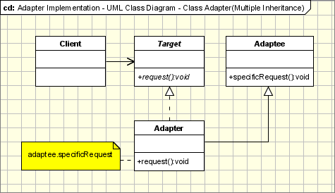

# [Adapter Pattern](https://www.oodesign.com/adapter-pattern.html) #

## Motivation ##

The adapter pattern is adapting between classes and objects. Like any adapter in the real world it is used to be an interface, a bridge between two objects. In real world we have adapters for power supplies, adapters for camera memory cards, and so on. Probably everyone have seen some adapters for memory cards. If you can not plug in the camera memory in your laptop you can use and adapter. You plug the camera memory in the adapter and the adapter in to laptop slot. That's it, it's really simple.

What about software development? It's the same. Can you imagine an situation when you have some class expecting some type of object and you have an object offering the same features, but exposing a different interface? Of course, you want to use both of them so you don't to implement again one of them, and you don't want to change existing classes, so why not create an adapter...

## Intent ##

* Convert the interface of a class into another interface clients expect.
* Adapter lets classes work together, that could not otherwise because of incompatible interfaces.

## Implementation ##

The figure below shows a UML class diagram for the Adapter Pattern:

The classes/objects participating in adapter pattern:

* **Target** - defines the domain-specific interface that Client uses.
* **Adapter** - adapts the interface Adaptee to the Target interface.
* **Adaptee** - defines an existing interface that needs adapting.
* **Client** - collaborates with objects conforming to the Target interface.

## Applicability & Examples ##

The visitor pattern is used when:

* When you have a class(Target) that invokes methods defined in an interface and you have a another class(Adapter) that doesn't implement the interface but implements the operations that should be invoked from the first class through the interface. You can change none of the existing code. The adapter will implement the interface and will be the bridge between the 2 classes.
*When you write a class (Target) for a generic use relying on some general interfaces and you have some implemented classes, not implementing the interface, that needs to be invoked by the Target class.

Adapters are encountered everywhere. From real world adapters to software adapters

* **Non Software Examples of Adapter Patterns** : Power Supply Adapters, card readers and adapters, ...

**Software Examples of Adapter Patterns**: Wrappers used to adopt 3rd parties libraries and frameworks - most of the applications using third party libraries use adapters as a middle layer between the application and the 3rd party library to decouple the application from the library. If another library has to be used only an adapter for the new library is required without having to change the application code.

## Specific problems and implementation ##

### Objects Adapters - Based on Delegation ###

Objects Adapters are the classical example of the adapter pattern. It uses composition, the Adaptee delegates the calls to Adaptee (opossed to class adapters which extends the Adaptee). This behaviour gives us a few advantages over the class adapters(however the class adapters can be implemented in languages allowing multiple inheritance). The main advantage is that the Adapter adapts not only the Adpatee but all its subclasses. All it's subclasses with one "small" restriction: all the subclasses which don't add new methods, because the used mechanism is delegation. So for any new method the Adapter must be changed or extended to expose the new methods as well. The main disadvantage is that it requires to write all the code for delegating all the necessary requests tot the Adaptee.

### Class Adapters - Based on (Multiple) Inheritance ###

Class adapters can be implemented in languages supporting multiple inheritance(Java, C# or PHP does not support multiple inheritance). Thus, such adapters can not be easy implemented in Java, C# or VB.NET. Class adapter uses inheritance instead of composition. It means that instead of delegating the calls to the Adaptee, it subclasses it. In conclusion it must subclass both the Target and the Adaptee. There are advantages and disadvantages:

* It adapts the specific Adaptee class. The class it extends. If that one is subclassed it can not be adapted by the existing adapter.
* It doesn't require all the code required for delegation, which must be written for an Object Adapter.

If the Target is represented by an interface instead of a class then we can talk about "class" adapters, because we can implement as many interfaces as we want.

### How Much the Adapter Should Do? ###

This question has a really simple response: it should do how much it has to in order to adapt. It's very simple, if the Target and Adaptee are similar then the adapter has just to delegate the requests from the Target to the Adaptee. If Target and Adaptee are not similar, then the adapter might have to convert the data structures between those and to implement the operations required by the Target but not implemented by the Adaptee.

### Two-Ways Adapters ###

The Two-Ways Adapters are adapters that implements both interfaces of Target and Adaptee. The adapted object can be used as Target in new systems dealing with Target classes or as Adaptee in other systems dealing with Adaptee classes. Going further on this line of thinking, we can have adapters implementing n interfaces, adapting to n systems. Two-way adapters and n-way adapters are hard to implement in systems not supporting multiple inheritance. If adapter has to extend the Target class it can not extent another class like Adaptee, so the Adaptee should be an interface and all the calls should be delegated from the adapter to the Adaptee object.

### Adapter Pattern and Strategy Pattern ###

Adapter Pattern and Strategy Pattern - there are many cases when the adapter can play the role of the Strategy Pattern. If we have several modules implementing the same functionality and we wrote adapters for them, the adapters are implementing the same interface. We can simply replace the adapters objects at run time because they implements the same interface.
