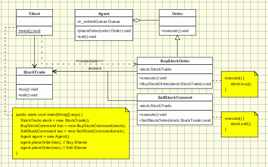
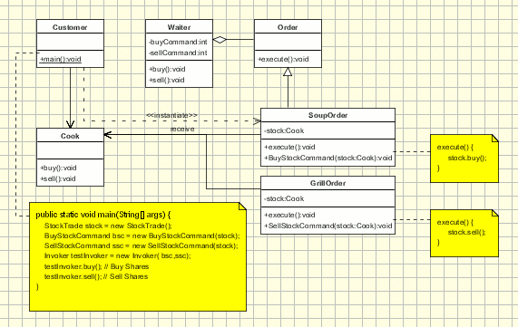
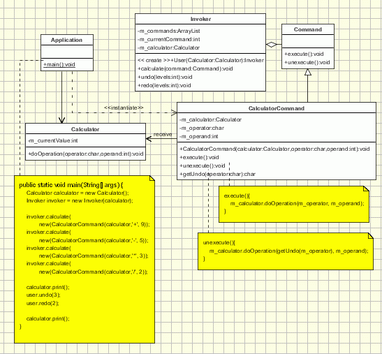

# Command Pattern #

“An object that contains a symbol, name or key that represents a list of commands, actions or keystrokes”. This is the definition of a macro, one that should be familiar to any computer user. From this idea the Command design pattern was given birth.

The Macro represents, at some extent, a command that is built from the reunion of a set of other commands, in a given order. Just as a macro, the Command design pattern encapsulates commands (method calls) in objects allowing us to issue requests without knowing the requested operation or the requesting object. Command design pattern provides the options to queue commands, undo/redo actions and other manipulations.

## Intent ##

* encapsulate a request in an object
* allows the parameterization of clients with different requests
* allows saving the requests in a queue

## Implementation ##

The idea and implementation of the Command design pattern is quite simple, as we will see in the diagram below, needing only few extra classes implemented.


The classes participating in the pattern are:

* Command - declares an interface for executing an operation;
* ConcreteCommand - extends the Command interface, implementing the Execute method by invoking the corresponding operations on Receiver. It defines a link between the Receiver and the action.
* Client - creates a ConcreteCommand object and sets its receiver;
* Invoker - asks the command to carry out the request;
* Receiver - knows how to perform the operations;

The Client asks for a command to be executed. The Invoker takes the command, encapsulates it and places it in a queue, in case there is something else to do first, and the ConcreteCommand that is in charge of the requested command, sending its result to the Receiver.

Here is a sample code of a classic implementation of this pattern for placing orders for buying and selling stocks:



The client creates some orders for buying and selling stocks (ConcreteCommands). Then the orders are sent to the agent (Invoker).The agent takes the orders and place them to the StockTrade system (Receiver). The agent keeps an internal queue with the order to be placed. Let's assume that the StockTrade system is closed each Monday, but the agent accepts orders, and queue them to be processed later on.

```java
public interface Order {
    public abstract void execute ( );
}

// Receiver class.
class StockTrade {
    public void buy() {
        System.out.println("You want to buy stocks");
    }
    public void sell() {
        System.out.println("You want to sell stocks ");
    }
}

// Invoker.
class Agent {
    private m_ordersQueue = new ArrayList();

    public Agent() {
    }
    
    void placeOrder(Order order) {
        ordersQueue.addLast(order);
        order.execute(ordersQueue.getFirstAndRemove());
    }    
}

//ConcreteCommand Class.
class BuyStockOrder implements Order {
    private StockTrade stock;
    public BuyStockOrder ( StockTrade st) {
        stock = st;
    }
    public void execute( ) {
        stock . buy( );
    }
}

//ConcreteCommand Class.
class SellStockOrder implements Order { 
    private StockTrade stock;
    public SellStockOrder ( StockTrade st) {
        stock = st;
    }
    public void execute( ) {
        stock . sell( );
    }
}

// Client
public class Client {
    public static void main(String[] args) {
        StockTrade stock = new StockTrade();
        BuyStockOrder bsc = new BuyStockOrder (stock);
        SellStockOrder ssc = new SellStockOrder (stock);
        Agent agent = new Agent();

        agent.placeOrder(bsc); // Buy Shares
        agent.placeOrder(ssc); // Sell Shares
    }
}
```

## Applicability & Examples ##

The applicability of the Command design pattern can be found in these cases below:

* parameterizes objects depending on the action they must perform
* specifies or adds in a queue and executes requests at different moments in time
* offers support for undoable actions (the Execute method can memorize the state and allow going back to that state)
* structures the system in high level operations that based on primitive operations
* decouples the object that invokes the action from the object that performs the action. Due to this usage it is also known as Producer - Consumer design pattern.

The example of the meal order at a restaurant is a very good one when trying to explain better how the pattern works:
The waiter (Invoker) takes the order from the customer on his pad. The order is then queued for the order cook and gets to the cook (Receiver) where it is processed.



In this case the actors in the scenario are the following: The Client is the customer. He sends his request to the receiver through the waiter, who is the Invoker. The waiter encapsulates the command (the order in this case) by writing it on the check and then places it, creating the ConcreteCommand object which is the command itself. The Receiver will be the cook that, after completing work on all the orders that were sent to him before the command in question, starts work on it. Another noticeable aspect of the example is the fact that the pad for the orders does not support only orders from the menu, so it can support commands to cook many different items.

Just the same way we can consider the example of an auto-repair shop. People come in with different cars that have different problems. The person at the front desk takes their information and places the car in a queue for repair. The information on the order is encapsulated in the paper the car owner will use when he comes back to pick up the fixed car. At some point the car will become the first item in the queue and the mechanic will repair it. Just as in the example above, the Client is the customer. The Invoker is the person at the front desk that takes the information on the car and its problems, the ConcreteCommand is the request for fixing the car and the Receiver is the mechanic.

The most used implementation of the command pattern is the one used to implement the undo options in applications:



Let's consider a calculator application. The application represents the Client. The calculator (Receiver) class is the main class used in the application to perform the commands. This might be as well the document class if we have a text editor application and we want to implement operations like copy/paste/etc.... When the application has to perform a command it creates the command and sent it to the invoker. The invoker calls the execute method of the command and adds it to a list containing all the commands. The execute method of the command delegate the call to the Calculator object. When undo operations are performed the invoker uses the list with all executed commands and calls for each one the unexecuted method. The redo operation works in the same manner.

## Specific problems and implementation ##

Now that we have understood how the pattern works, it's time to take a look at its advantages and flaws, too.

### The intelligence of a command ###

There are two extremes that a programmer must avoid when using this pattern:

1. The command is just a link between the receiver and the actions that carry out the request
2. The command implements everything itself, without sending anything to the receiver.
We must always keep in mind the fact that the receiver is the one who knows how to perform the operations needed, the purpose of the command being to help the client to delegate its request quickly and to make sure the command ends up where it should.

### Undo and redo actions ###

As mentioned above, some implementations of the Command design pattern include parts for supporting undo and redo of actions. In order to do that a mechanism to obtain past states of the Receiver object is needed; in order to achieve this there are two options:

* Before running each command a snapshot of the receiver state is stored in memory. This does not require much programming effort but can not be always applied. For example doing this in an image processing application would require storing images in memory after each step, which is practically impossible. 
* Instead of storing receiver objects states, the set of performed operations are stored in memory. In this case the command and receiver classes should implement the inverse algorithms to undo each action. This will require additional programming effort, but less memory will be required. Sometimes for undo/redo actions the command should store more information about the state of the receiver objects. A good idea in such cases is to use the Memento Pattern.

### Asynchronous Method Invocation ###

Another usage for the command design pattern is to run commands asynchronous in background of an application. In this case the invoker is running in the main thread and sends the requests to the receiver which is running in a separate thread. The invoker will keep a queue of commands to be run and will send them to the receiver while it finishes running them.

Instead of using one thread in which the receiver is running more threads can be created for this. But for performance issues (thread creation is consuming) the number of threads should be limited. In this case the invoker will use a pool of receiver threads to run command asynchronously.

### Adding new commands ###

The command object decouples the object that invokes the action from the object that performs the action. There are implementations of the pattern in which the invoker instantiates the concrete command objects. In this case if we need to add a new command type we need to change the invoker as well. And this would violate the Open Close Principle (OCP). In order to have the ability to add new commands with minimum of effort we have to make sure that the invoker is aware only about the abstract command class or interface.

### Using composite commands ###

When adding new commands to the application we can use the composite pattern to group existing commands in another new command. This way, macros can be created from existing commands.

## Hot spot ##

The main advantage of the command design pattern is that it decouples the object that invokes the operation from the one that know how to perform it. And this advantage must be kept. There are implementations of this design pattern in which the invoker is aware of the concrete commands classes. This is wrong making the implementation more tightly coupled. The invoker should be aware only about the abstract command class.
