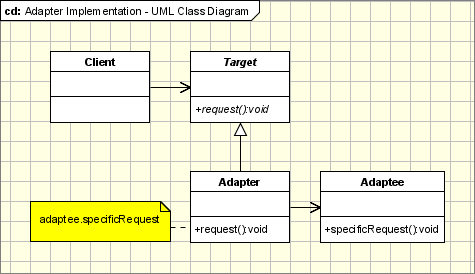
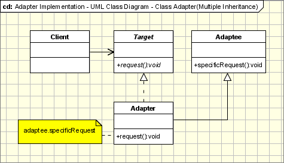

# [适配器模式](https://www.oodesign.com/adapter-pattern.html) #
<!-- # [Adapter Pattern](https://www.oodesign.com/adapter-pattern.html) # -->

## 动机 ##
<!-- ## Motivation ## -->

适配器模式适用于类和对象。像现实世界中的任何适配器一样，它被用作接口，两个对象之间的桥梁。在现实世界中，我们有适用于电源的适配器，用于相机存储卡的适配器等。可能每个人都看过一些存储卡适配器。如果您无法插入笔记本电脑中的相机内存，则可以使用适配器。将相机内存插入适配器，将适配器插入笔记本电脑插槽。就是这样，它非常简单。
<!-- The adapter pattern is adapting between classes and objects. Like any adapter in the real world it is used to be an interface, a bridge between two objects. In real world we have adapters for power supplies, adapters for camera memory cards, and so on. Probably everyone have seen some adapters for memory cards. If you can not plug in the camera memory in your laptop you can use and adapter. You plug the camera memory in the adapter and the adapter in to laptop slot. That's it, it's really simple. -->

那么软件开发呢？一样的。你能想象一种情况，当你有一些类期望某种类型的对象，并且你有一个提供相同功能的对象，但暴露不同的接口？当然，你想要同时使用它们，所以你不要再实现其中一个，并且你不想更改现有的类，那么为什么不创建一个适配器......
<!-- What about software development? It's the same. Can you imagine an situation when you have some class expecting some type of object and you have an object offering the same features, but exposing a different interface? Of course, you want to use both of them so you don't to implement again one of them, and you don't want to change existing classes, so why not create an adapter... -->

## 意图 ##
<!-- ## Intent ## -->

* 将类的接口转换为客户期望的另一个接口。
<!-- * Convert the interface of a class into another interface clients expect. -->
* 适配器让原本由于接口不兼容而不能一起工作的类一起工作。
<!-- * Adapter lets classes work together, that could not otherwise because of incompatible interfaces. -->

## 实现 ##
<!-- ## Implementation ## -->

下图显示了适配器模式的UML类图：
<!-- The figure below shows a UML class diagram for the Adapter Pattern: -->

<!--  -->

参与适配器模式的类/对象：
<!-- The classes/objects participating in adapter pattern: -->

* **Target** - 定义客户端使用的特定于域的接口。
<!-- * **Target** - defines the domain-specific interface that Client uses. -->
* **Adapter** - 使接口Adaptee适应Target接口。
<!-- * **Adapter** - adapts the interface Adaptee to the Target interface. -->
* **Adaptee** - 定义需要适应的现有界面。
<!-- * **Adaptee** - defines an existing interface that needs adapting. -->
* **Client** - 与符合Target接口的对象协作。
<!-- * **Client** - collaborates with objects conforming to the Target interface. -->

## 适用性和示例 ##
<!-- ## Applicability & Examples ## -->

在以下情况下使用访客模式：
<!-- The visitor pattern is used when: -->

* 当你有一个类（Target）调用接口中定义的方法，并且你有另一个类（Adapter）没有实现接口但是实现了应该通过接口从第一个类调用的操作。您不能更改任何现有代码。适配器将实现接口，并将成为两个类之间的桥梁。
<!-- * When you have a class(Target) that invokes methods defined in an interface and you have a another class(Adapter) that doesn't implement the interface but implements the operations that should be invoked from the first class through the interface. You can change none of the existing code. The adapter will implement the interface and will be the bridge between the 2 classes. -->
* 当您为依赖于某些通用接口的泛型用途编写类（Target）并且您有一些实现的类而不是实现接口时，需要由Target类调用。
<!-- * When you write a class (Target) for a generic use relying on some general interfaces and you have some implemented classes, not implementing the interface, that needs to be invoked by the Target class. -->

适配器遇到无处不在。从现实世界的适配器到软件适配器
<!-- Adapters are encountered everywhere. From real world adapters to software adapters -->

* **非软件适配器模式的例子** ：电源适配器,读卡器适配器……
<!-- * **Non Software Examples of Adapter Patterns** : Power Supply Adapters, card readers and adapters, ... -->

* **软件适配器模式的例子**：用于采用第三方库和框架的封装 - 大多数使用第三方库的应用程序使用适配器作为应用程序和第三方库之间的中间层，以将应用程序与库分离。如果必须使用另一个库，则只需要新库的适配器，而无需更改应用程序代码。
<!-- **Software Examples of Adapter Patterns**: Wrappers used to adopt 3rd parties libraries and frameworks - most of the applications using third party libraries use adapters as a middle layer between the application and the 3rd party library to decouple the application from the library. If another library has to be used only an adapter for the new library is required without having to change the application code. -->

## 具体问题和实现 ##
<!-- ## Specific problems and implementation ## -->

### 对象适配器——基于委托 ###
<!-- ### Objects Adapters - Based on Delegation ### -->

对象适配器是适配器模式的经典示例。它使用组合，Adaptee将调用委托给Adaptee（对适用于扩展Adaptee的类适配器）。这种行为比类适配器具有一些优势（但是类适配器可以用允许多重继承的语言实现）。主要优点是适配器不仅适用于Adpatee，还适用于其所有子类。所有它的子类都有一个“小”限制：所有不添加新方法的子类，因为使用的机制是委托。因此，对于任何新方法，必须更改或扩展适配器以公开新方法。主要的缺点是它需要编写所有代码以便将所有必要的请求委托给Adaptee。
<!-- Objects Adapters are the classical example of the adapter pattern. It uses composition, the Adaptee delegates the calls to Adaptee (opossed to class adapters which extends the Adaptee). This behaviour gives us a few advantages over the class adapters(however the class adapters can be implemented in languages allowing multiple inheritance). The main advantage is that the Adapter adapts not only the Adpatee but all its subclasses. All it's subclasses with one "small" restriction: all the subclasses which don't add new methods, because the used mechanism is delegation. So for any new method the Adapter must be changed or extended to expose the new methods as well. The main disadvantage is that it requires to write all the code for delegating all the necessary requests tot the Adaptee. -->

### 类适配器——基于(多个)继承 ###
<!-- ### Class Adapters - Based on (Multiple) Inheritance ### -->

<!--  -->

类适配器可以用支持多继承的语言实现（Java，C#器使用继承而不是组合。这意味着它不是将调用委托给Adaptee，而是将其子类化。总之，它必须是目标和适应者的子类。有利有弊：
<!-- Class adapters can be implemented in languages supporting multiple inheritance(Java, C# or PHP does not support multiple inheritance). Thus, such adapters can not be easy implemented in Java, C# or VB.NET. Class adapter uses inheritance instead of composition. It means that instead of delegating the calls to the Adaptee, it subclasses it. In conclusion it must subclass both the Target and the Adaptee. There are advantages and disadvantages: -->

* 它适应特定的Adaptee类。它扩展的类。如果那个是子类，则现有适配器无法对其进行调整。
<!-- * It adapts the specific Adaptee class. The class it extends. If that one is subclassed it can not be adapted by the existing adapter. -->
* 它不需要委托所需的所有代码，必须为对象适配器编写代码。
<!-- * It doesn't require all the code required for delegation, which must be written for an Object Adapter. -->

如果Target由接口而不是类表示，那么我们可以讨论“类”适配器，因为我们可以实现任意数量的接口。
<!-- If the Target is represented by an interface instead of a class then we can talk about "class" adapters, because we can implement as many interfaces as we want. -->

### 适配器应该做多少? ###
<!-- ### How Much the Adapter Should Do? ### -->

这个问题有一个非常简单的回答：它应该做多少才能适应。这很简单，如果Target和Adaptee类似，那么适配器只需将来自Target的请求委托给Adaptee。如果Target和Adaptee不相似，那么适配器可能必须在这些之间转换数据结构并实现Target所需的操作，但Adaptee不实现。
<!-- This question has a really simple response: it should do how much it has to in order to adapt. It's very simple, if the Target and Adaptee are similar then the adapter has just to delegate the requests from the Target to the Adaptee. If Target and Adaptee are not similar, then the adapter might have to convert the data structures between those and to implement the operations required by the Target but not implemented by the Adaptee. -->

### 双向适配器 ###
<!-- ### Two-Ways Adapters ### -->

双向适配器是实现Target和Adaptee的两个接口的适配器。适应对象可以在处理Target类的新系统中用作Target，或者在处理Adaptee类的其他系统中用作Adaptee。进一步思考这个思路，我们可以让适配器实现n个接口，适应n个系统。双向适配器和n路适配器很难在不支持多继承的系统中实现。如果适配器必须扩展Target类，则它不能扩展另一个类，如Adaptee，因此Adaptee应该是一个接口，并且所有调用都应该从适配器委托给Adaptee对象。
<!-- The Two-Ways Adapters are adapters that implements both interfaces of Target and Adaptee. The adapted object can be used as Target in new systems dealing with Target classes or as Adaptee in other systems dealing with Adaptee classes. Going further on this line of thinking, we can have adapters implementing n interfaces, adapting to n systems. Two-way adapters and n-way adapters are hard to implement in systems not supporting multiple inheritance. If adapter has to extend the Target class it can not extent another class like Adaptee, so the Adaptee should be an interface and all the calls should be delegated from the adapter to the Adaptee object. -->

### 适配器模式和战略模式 ###
<!-- ### Adapter Pattern and Strategy Pattern ### -->

适配器模式和策略模式 - 在许多情况下适配器可以扮演策略模式的角色。如果我们有几个模块实现相同的功能，并且我们为它们编写了适配器，那么适配器正在实现相同的接口。我们可以在运行时简单地替换适配器对象，因为它们实现了相同的接口。
<!-- Adapter Pattern and Strategy Pattern - there are many cases when the adapter can play the role of the Strategy Pattern. If we have several modules implementing the same functionality and we wrote adapters for them, the adapters are implementing the same interface. We can simply replace the adapters objects at run time because they implements the same interface. -->
