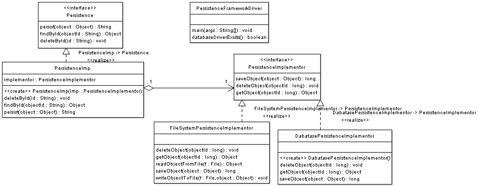

# [桥接模式](https://www.oodesign.com/bridge-pattern.html) #
<!-- # [Bridge Pattern](https://www.oodesign.com/bridge-pattern.html) # -->

## 动机 ##
<!-- ## Motivation ## -->

有时，抽象应具有不同的实现。考虑使用关系数据库或文件系统结构（文件和文件夹）在不同平台上处理对象持久性的对象。一个简单的实现可以选择扩展对象本身，以实现文件系统和RDBMS的功能。但是，这种实现会产生问题。继承将实现绑定到抽象上，因此很难独立地修改，扩展和重用抽象和实现。
<!-- Sometimes an abstraction should have different implementations; consider an object that handles persistence of objects over different platforms using either relational databases or file system structures (files and folders). A simple implementation might choose to extend the object itself to implement the functionality for both file system and RDBMS. However this implementation would create a problem; Inheritance binds an implementation to the abstraction and thus it would be difficult to modify, extend, and reuse abstraction and implementation independently. -->

## 意图 ##
<!-- ## Intent ## -->

* 这种模式的目的是将抽象与实现分离开来，以便两者可以独立变化。
<!-- * The intent of this pattern is to decouple abstraction from implementation so that the two can vary independently. -->

## 实现 ##
<!-- ## Implementation ## -->

下图显示了一个UML类图的桥模式:
<!-- The figure below shows a UML class diagram for the Bridge Pattern: -->

<!--  -->

桥接模式的参与者类有:
<!-- The participants classes in the bridge pattern are: -->

* **Abstraction** - 抽象定义抽象接口。
<!-- * **Abstraction** - Abstraction defines abstraction interface. -->
* **AbstractionImpl** - 使用对类型为Implementor的对象的引用来实现抽象接口。
<!-- * **AbstractionImpl** - Implements the abstraction interface using a reference to an object of type Implementor. -->
* **Implementor** - 实现者定义实现类的接口。该接口不需要直接对应于抽象接口，并且可以有很大的不同。抽象imp提供了一个由Implementor接口提供的操作的实现。
<!-- * **Implementor** - Implementor defines the interface for implementation classes. This interface does not need to correspond directly to abstraction interface and can be very different. Abstraction imp provides an implementation in terms of operations provided by Implementor interface. -->
* **ConcreteImplementor1, ConcreteImplementor2** - 实现了系统接口。
<!-- * **ConcreteImplementor1, ConcreteImplementor2** - Implements the Implementor interface. -->

## 描述 ##
<!-- ## Description ## -->

可以通过抽象实现来实现抽象，并且该实现不依赖于Implementor接口的任何具体实现者。扩展抽象不会影响实现者。同样扩展实现者对抽象没有影响。
<!-- An Abstraction can be implemented by an abstraction implementation, and this implementation does not depend on any concrete implementers of the Implementor interface. Extending the abstraction does not affect the Implementor. Also extending the Implementor has no effect on the Abstraction. -->

## 适用性和示例 ##
<!-- ## Applicability & Examples ## -->

桥模式适用于需要避免抽象和实现之间的永久绑定,当抽象和实现需要独立变化。使用桥接模式将使客户端代码不变,不需要重新编译代码。
<!-- The bridge pattern applies when there is a need to avoid permanent binding between an abstraction and an implementation and when the abstraction and implementation need to vary independently. Using the bridge pattern would leave the client code unchanged with no need to recompile the code. -->

### 示例——对象持久化API的例子 ###
<!-- ### Example - Object Persistence API Example ### -->

如前所述，根据是否存在关系数据库，文件系统以及基础操作系统，持久性API可以具有许多实现。
<!-- As discussed previously a persistence API can have many implementations depending on the presence or absence of a relational database, a file system, as well as on the underlying operating system. -->

<!--  -->

来源:点击这里查看java源代码
<!-- Source:  [Click here to see java source code](https://www.oodesign.com/bridge-pattern-object-persistence-api-example-java-sourcecode.html) -->

## 具体问题和实现 ##
<!-- ## Specific problems and implementation ## -->

### 图形用户界面框架 ###
<!-- ### Graphical User Interface Frameworks ### -->

图形用户界面框架使用桥接模式将抽象与特定于平台的实现分开。例如，对于使用Linux或Mac OS的桥模式，GUI框架使用桥模式将Window抽象与Window实现分开。
<!-- Graphical User Interface Frameworks use the bridge pattern to separate abstractions from platform specific implementation. For example GUI frameworks separate a Window abstraction from a Window implementation for Linux or Mac OS using the bridge pattern. -->
 
### 相关模式 ###
<!-- ### Related Patterns ### -->

**抽象工厂模式** - 抽象工厂模式可用于创建和配置特定的桥接，例如，工厂可以在运行时选择合适的具体实现器。
<!-- **Abstract Factory Pattern** - An Abstract Factory pattern can be used create and configure a particular Bridge, for example a factory can choose the suitable concrete implementor at runtime. -->

## 后果 ##
<!-- ## Consequences ## -->

### 已知用途: ###
<!-- ### Known Uses: ### -->

* 解耦接口和实现。实现未永久绑定到接口。可以在运行时配置甚至切换抽象的实现。
<!-- * Decoupling interface and implementation. An implementation is not bound permanently to an interface. The implementation of an abstraction can be configured and even switched at run-time. -->
* 抽象和实现者层次结构可以独立扩展。
<!-- * Abstraction and Implementor hierarchies can be extended independently. -->

### 已知用途: ###
<!-- ### Known Uses: ### -->

* 正如前面讨论的GUI框架。
<!-- * GUI frameworks as discussed previously. -->
* 如前所述的持久性框架。
<!-- * Persistence Frameworks as discussed previously. -->
