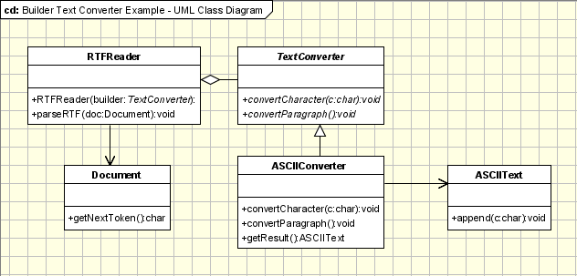

# 建造者模式 #
<!-- # Builder Pattern #  -->

## 动机
<!-- ## Motivation ## -->

应用程序越复杂，所使用的类和对象的复杂性就会增加。复杂的物体是由其他物体产生的部件组成的，在建造时需要特别小心。应用程序可能需要一种机制来构建独立于组成该对象的对象的复杂对象。如果这是您遇到的问题，您可能需要尝试使用构建器（或自适应构建器）设计模式。

<!-- The more complex an application is the complexity of classes and objects used increases. Complex objects are made of parts produced by other objects that need special care when being built. An application might need a mechanism for building complex objects that is independent from the ones that make up the object. If this is the problem you are being confronted with, you might want to try using the Builder (or Adaptive Builder) design pattern. -->

此模式允许客户端对象通过仅指定其类型和内容来构造复杂对象，而不受与对象表示相关的详细信息的影响。这样，构建过程可用于创建不同的表示。该过程的逻辑与创建复杂对象所使用的实际步骤隔离，因此可以再次使用该过程来从与第一个对象相同的一组简单对象创建不同的对象。

<!-- This pattern allows a client object to construct a complex object by specifying only its type and content, being shielded from the details related to the object's representation. This way the construction process can be used to create different representations. The logic of this process is isolated form the actual steps used in creating the complex object, so the process can be used again to create a different object form the same set of simple objects as the first one.  -->

 ## 意图

<!-- ## Intent ## -->

定义一个实例用于创建对象，但让子类决定实例化哪个类 通过公共接口引用新创建的对象
<!-- Defines an instance for creating an object but letting subclasses decide which class to instantiate
Refers to the newly created object through a common interface

## 执行
<!-- ## Implementation ## -->

Builder 设计模式使用 Factory Builder 模式来决定启动哪个具体类来构建所需类型的对象，正如我们将在下面的 UML 图中看到的那样：
<!-- The Builder design pattern uses the Factory Builder pattern to decide which concrete class to initiate in order to build the desired type of object, as we will see below in the UML diagram: -->


此模式中的参与者类是：
<!-- The participants classes in this pattern are: -->

* **Builder** 类指定用于创建 Product 对象的各个部分的抽象接口。
<!-- * The **Builder** class specifies an abstract interface for creating parts of a Product object. -->
* **ConcreteBuilder** 通过实现 Builder 接口来构建和组合产品的各个部分。它定义并跟踪它创建的表示，并提供用于保存产品的界面。
<!-- * The **ConcreteBuilder** constructs and puts together parts of the product by implementing the Builder interface. It defines and keeps track of the representation it creates and provides an interface for saving the product. -->
* **Director** 类使用 Builder 接口构造复杂对象。
<!-- * The **Director** class constructs the complex object using the Builder interface. -->
* **Product** 代表正在构建的复杂对象。
<!-- * The **Product** represents the complex object that is being built. -->

客户端（可能是另一个对象，也可能是调用应用程序的 main() 方法的实际客户端）启动 Builder 和 Director 类。 Builder 表示需要根据更简单的对象和类型构建的复杂对象。 Director类中的构造函数从Client接收一个Builder对象作为参数，并负责调用Builder类的相应方法。为了向客户端提供所有具体构建器的接口，构建器类应该是一个抽象类。这样，您只需定义结构并重用实际构建过程的逻辑即可添加新类型的复杂对象。 Client 是唯一需要了解新类型的人，Director 需要知道要调用 Builder 的哪些方法。
<!-- The client, that may be either another object or the actual client that calls the main() method of the application, initiates the Builder and Director class. The Builder represents the complex object that needs to be built in terms of simpler objects and types. The constructor in the Director class receives a Builder object as a parameter from the Client and is responsible for calling the appropriate methods of the Builder class. In order to provide the Client with an interface for all concrete Builders, the Builder class should be an abstract one. This way you can add new types of complex objects by only defining the structure and reusing the logic for the actual construction process. The Client is the only one that needs to know about the new types, the Director needing to know which methods of the Builder to call. -->

以下示例讨论文本转换应用程序的情况：
<!-- The following example discusses the case of a text converting application: -->



客户需要将文档从 RTF 格式转换为 ASCII 格式。为此，它调用 createASCIIText 方法，该方法将要转换的文档作为参数。此方法调用具体构建器 ASCIIConverter，它扩展了 Builder、TextConverter，并重写了它用于转换字符和段落的两个方法，还调用了 Director、RTFReader，它解析文档并根据遇到的标记类型调用构建器的方法。产品 ASCIIText 是通过附加转换后的字符逐步构建的。
<!-- The Client needs to convert a document from RTF format to ASCII format. There for, it calls the method createASCIIText that takes as a parameter the document that will be converted. This method calls the concrete builder, ASCIIConverter, that extends the Builder, TextConverter, and overrides its two methods for converting characters and paragraphs, and also the Director, RTFReader, that parses the document and calls the builder's methods depending on the type of token encountered. The product, the ASCIIText, is built step by step, by appending converted characters. -->

```java
//Abstract Builder
class abstract class TextConverter{
	abstract void convertCharacter(char c);
	abstract void convertParagraph();
}

// Product
class ASCIIText{
	public void append(char c){ //Implement the code here }
}

//Concrete Builder
class ASCIIConverter extends TextConverter{
	ASCIIText asciiTextObj;//resulting product

	/*converts a character to target representation and appends to the resulting*/
	object void convertCharacter(char c){
		char asciiChar = new Character(c).charValue();
			//gets the ascii character
		asciiTextObj.append(asciiChar);
	}
	void convertParagraph(){}
	ASCIIText getResult(){
		return asciiTextObj;
	}
}

//This class abstracts the document object
class Document{
	static int value;
	char token;
	public char getNextToken(){
		//Get the next token
		return token;
	}
}

//Director
class RTFReader{
	private static final char EOF='0'; //Delimitor for End of File
	final char CHAR='c';
	final char PARA='p';
	char t;
	TextConverter builder;
	RTFReader(TextConverter obj){
		builder=obj;
	}
	void parseRTF(Document doc){
		while ((t=doc.getNextToken())!= EOF){
			switch (t){
				case CHAR: builder.convertCharacter(t);
				case PARA: builder.convertParagraph();
			}
		}
	}
}

//Client
public class Client{
	void createASCIIText(Document doc){
		ASCIIConverter asciiBuilder = new ASCIIConverter();
		RTFReader rtfReader = new RTFReader(asciiBuilder);
		rtfReader.parseRTF(doc);
		ASCIIText asciiText = asciiBuilder.getResult();
	}
	public static void main(String args[]){
		Client client=new Client();
		Document doc=new Document();
		client.createASCIIText(doc);
		system.out.println("This is an example of Builder Pattern");
	}
}
```
## 适用性和示例
<!-- ## Applicability & Examples ## -->

构建器模式在以下情况下使用：
<!-- Builder Pattern is used when: -->

* 复杂对象的创建算法独立于实际组成对象的部分
<!-- * the creation algorithm of a complex object is independent from the parts that actually compose the object -->
* 系统需要允许正在构建的对象有不同的表示
<!-- * the system needs to allow different representations for the objects that are being built -->

### 示例 1 - 车辆制造商
<!-- ### Example 1 - Vehicle Manufacturer ### -->

让我们以一家汽车制造商为例，该制造商可以用一组零件制造汽车、自行车、摩托车或踏板车。在这种情况下，Builder 将成为 VehicleBuilder。它指定了用于构建上面列表中的任何车辆的接口，对每种类型的车辆使用相同的部件集和不同的规则集。 ConcreteBuilders 将是附加到正在构建的每个对象的构建器。产品当然是正在建造的车辆，而总监是制造商及其商店。
<!-- Let us take the case of a vehicle manufacturer that, from a set of parts, can build a car, a bicycle, a motorcycle or a scooter. In this case the Builder will become the VehicleBuilder. It specifies the interface for building any of the vehicles in the list above, using the same set of parts and a different set of rules for every type of type of vehicle. The ConcreteBuilders will be the builders attached to each of the objects that are being under construction. The Product is of course the vehicle that is being constructed and the Director is the manufacturer and its shop. -->

### 示例 1 - 学生考试
<!-- ### Example 1 - Students Exams ### -->

如果我们有一个应用程序可供大学学生使用，为他们提供考试成绩列表，则该应用程序需要根据使用它的用户、必须登录的用户以不同的方式运行这意味着，例如，管理员需要启用一些按钮，需要为学生（普通用户）禁用一些按钮。 Builder提供根据登录信息构建表单的接口。 ConcreteBuilders 是每种类型用户的特定形式。产品是应用程序在给定情况下使用的最终表单，而主管是根据登录信息需要特定表单的应用程序。
<!-- If we have an application that can be used by the students of a University to provide them with the list of their grades for their exams, this application needs to run in different ways depending on the user that is using it, user that has to log in. This means that, for example, the admin needs to have some buttons enabled, buttons that needs to be disabled for the student, the common user. The Builder provides the interface for building form depending on the login information. The ConcreteBuilders are the specific forms for each type of user. The Product is the final form that the application will use in the given case and the Director is the application that, based on the login information, needs a specific form. -->

## 具体问题及实施
<!-- ## Specific problems and implementation ## -->

### 构建器和抽象工厂
<!-- ### Builder and Abstract Factory ### -->

Builder 设计模式在某种程度上与抽象工厂模式非常相似。这就是为什么能够区分使用其中一种或另一种的情况很重要。对于抽象工厂，客户端使用工厂的方法来创建自己的对象。在 Builder 的例子中，Builder 类被指示如何创建对象，然后被要求提供该对象，但是将类组合在一起的方式取决于 Builder 类，这个细节造成了两种模式之间的差异。
<!-- The Builder design pattern is very similar, at some extent, to the Abstract Factory pattern. That's why it is important to be able to make the difference between the situations when one or the other is used. In the case of the Abstract Factory, the client uses the factory's methods to create its own objects. In the Builder's case, the Builder class is instructed on how to create the object and then it is asked for it, but the way that the class is put together is up to the Builder class, this detail making the difference between the two patterns. -->

### 产品通用接口
<!-- ### Common interface for products ### -->

在实践中，具体构建者创建的产品具有显着不同的结构，因此如果没有理由派生不同的产品公共父类。这也将构建器模式与抽象工厂模式区分开来，抽象工厂模式创建从公共类型派生的对象。
<!-- In practice the products created by the concrete builders have a structure significantly different, so if there is not a reason to derive different products a common parent class. This also distinguishes the Builder pattern from the Abstract Factory pattern which creates objects derived from a common type. -->
