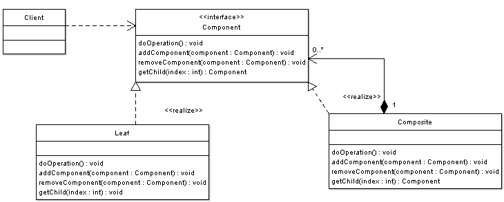

# [组合模式](https://www.oodesign.com/composite-pattern.html) #
<!-- # [Composite Pattern](https://www.oodesign.com/composite-pattern.html) # -->

## 动机 ##
<!-- ## Motivation ## -->

有时程序需要操纵树数据结构，并且有必要统一对待子节点和叶节点。例如，考虑一个操纵文件系统的程序。文件系统是一种树结构，其中包含作为文件夹的子节点以及作为文件的叶节点。请注意，文件夹对象通常包含一个或多个文件或文件夹对象，因此是一个复杂对象，其中文件是一个简单对象。还要注意，由于文件和文件夹具有许多共同的操作和属性，例如移动和复制文件或文件夹，列出文件或文件夹的属性（例如文件名和大小），因此通过定义文件系统资源接口来统一处理文件和文件夹将更加容易和方便。
<!-- There are times when a program needs to manipulate a tree data structure and it is necessary to treat both Branches as well as Leaf Nodes uniformly. Consider for example a program that manipulates a file system. A file system is a tree structure that contains Branches which are Folders as well as Leaf nodes which are Files. Note that a folder object usually contains one or more file or folder objects and thus is a complex object where a file is a simple object. Note also that since files and folders have many operations and attributes in common, such as moving and copying a file or a folder, listing file or folder attributes such as file name and size, it would be easier and more convenient to treat both file and folder objects uniformly by defining a File System Resource Interface. -->

## 意图 ##
<!-- ## Intent ## -->

* 这种模式的目的是将对象组合成树形结构，以表示“部分-整体”的层次结构。
<!-- * The intent of this pattern is to compose objects into tree structures to represent part-whole hierarchies. -->
* Composite可以使用户对单个对象和组合对象的使用具有一致性。
<!-- * Composite lets clients treat individual objects and compositions of objects uniformly. -->

## 实现 ##
<!-- ## Implementation ## -->

下图显示了一个组合模式的UML类图:
<!-- The figure below shows a UML class diagram for the Composite Pattern: -->

<!--  -->

* **根节点(Component)** - Component是树叶节点和树枝节点的抽象。它定义了组合中的对象必须实现的接口。例如，文件系统资源定义了文件和文件夹的移动，复制，重命名和获取大小方法。
<!-- * **Component** - Component is the abstraction for leafs and composites. It defines the interface that must be implemented by the objects in the composition. For example a file system resource defines move, copy, rename, and getSize methods for files and folders. -->
* **树叶节点(Leaf)** - 树叶节点是没有子节点的对象。它们实现由Component接口描述的服务。例如一个文件对象实现移动、复制、重命名以及获取大小相关Component接口的方法。
<!-- * **Leaf** - Leafs are objects that have no children. They implement services described by the Component interface. For example a file object implements move, copy, rename, as well as getSize methods which are related to the Component interface. -->
* **树枝节点(Composite)** - 组合除了存储由部件接口定义的方法之外，还存储子部件。组合通过委派给子部件来实现在Component接口中定义的方法。此外，部件还提供了其他添加，删除和获取部件的方法。
<!-- * **Composite** - A Composite stores child components in addition to implementing methods defined by the component interface. Composites implement methods defined in the Component interface by delegating to child components. In addition composites provide additional methods for adding, removing, as well as getting components. -->
* **Client** - 客户端使用Component接口操作层次结构中的对象。
<!-- * **Client** - The client manipulates objects in the hierarchy using the component interface. -->

客户端具有对树数据结构的引用，并且需要在所有节点上执行操作，而与节点可能是子节点还是叶节点这一事实无关。客户端仅使用Component接口获取对所需节点的引用，并使用此接口处理该节点；节点是组合组件还是叶节点都没有关系。
<!-- A client has a reference to a tree data structure and needs to perform operations on all nodes independent of the fact that a node might be a branch or a leaf. The client simply obtains reference to the required node using the component interface, and deals with the node using this interface; it doesn't matter if the node is a composite or a leaf. -->

## 适用性和例子 ##
<!-- ## Applicability & Examples ## -->

当存在“部分-整体”的层次结构并且客户需要统一处理对象时，不管对象可能是叶还是分支，都适用组合模式。
<!-- The composite pattern applies when there is a part-whole hierarchy of objects and a client needs to deal with objects uniformly regardless of the fact that an object might be a leaf or a branch.  -->

### 示例——图形编辑器 ###
<!-- ### Example - Graphics Drawing Editor. ### -->

在图形编辑器中，形状可以是基本形状，也可以是复杂形状。简单形状的示例是直线，复杂形状是由四个线对象组成的矩形。由于形状具有许多共同的操作，例如将形状渲染到屏幕上，并且形状遵循局部整体层次结构，因此可以使用组合模式来使程序均匀地处理所有形状。
<!-- In graphics editors a shape can be basic or complex. An example of a simple shape is a line, where a complex shape is a rectangle which is made of four line objects. Since shapes have many operations in common such as rendering the shape to screen, and since shapes follow a part-whole hierarchy, composite pattern can be used to enable the program to deal with all shapes uniformly. -->

在示例中，我们可以看到以下参与者：
<!-- In the example we can see the following actors: -->

* **Shape (Component)** -形状是直线，矩形（叶）和ComplexShapes（复合物）的抽象。
<!-- * **Shape (Component)** - Shape is the abstraction for Lines, Rectangles (leafs) and and ComplexShapes (composites). -->
* **Line, Rectangle (Leafs)** -没有子级的对象。它们实现Shape接口描述的服务。
<!-- * **Line, Rectangle (Leafs)** - objects that have no children. They implement services described by the Shape interface. -->
* **ComplexShape (Composite)** - 除了实现Shape接口定义的方法外，CompositeShape还存储子Shape。
<!-- * **ComplexShape (Composite)** - A Composite stores child Shapes in addition to implementing methods defined by the Shape interface. -->
* **GraphicsEditor (Client)** - GraphicsEditor在层次结构中操纵Shapes。
<!-- * **GraphicsEditor (Client)** - The GraphicsEditor manipulates Shapes in the hierarchy. -->

**替代实现**: 请注意，在前面的示例中，有时我们避免通过Shape接口处理复合对象，而专门将它们作为复合对象处理（使用addToShape()方法时）。为了避免这种情况并进一步提高一致性，可以添加一些方法来添加，删除以及将子部件添加到Shape接口。下面的UML图显示了它：
<!-- **Alternative Implementation**: Note that in the previous example there were times when we have avoided dealing with composite objects through the Shape interface and we have specifically dealt with them as composites (when using the method addToShape()). To avoid such situations and to further increase uniformity one can add methods to add, remove, as well as get child components to the Shape interface. The UML diagram below shows it: -->

<!--  -->

源：[点击这里查看java源代码](https://www.oodesign.com/composite-pattern-shapes-example-java-sourcecode.html)
<!-- Source:  [Click here to see java source code](https://www.oodesign.com/composite-pattern-shapes-example-java-sourcecode.html) -->

## 具体问题和实现 ##
<!-- ## Specific problems and implementation ## -->

图形编辑器使用组合模式来实现复杂和简单的图形，如前所述。
<!-- Graphics Editors use composite pattern to implement complex and simple graphics as previously explained. -->

文件系统实现使用如上所述的组合设计模式。
<!-- File System implementations use the composite design pattern as described previously. -->

### 后果 ###
<!-- ### Consequences ### -->

* 组合模式定义了由原始对象和复合对象组成的类层次结构。原始对象可以组成更复杂的对象，而后者又可以组成。
<!-- * The composite pattern defines class hierarchies consisting of primitive objects and composite objects. Primitive objects can be composed into more complex objects, which in turn can be composed. -->
* 客户端通过部件接口统一对待原始对象和组合对象，这使客户端代码变得简单。
<!-- * Clients treat primitive and composite objects uniformly through a component interface which makes client code simple. -->
* 添加新部件很容易，并且由于客户端通过部件接口处理新部件，因此不需要更改客户端代码。
<!-- * Adding new components can be easy and client code does not need to be changed since client deals with the new components through the component interface. -->

### 相关模式 ###
<!-- ### Related Patterns ### -->

**装饰器模式** - 装饰器通常与组合一起使用。当装饰器和合成器一起使用时，它们通常将具有一个公共的父类。因此，装饰器将必须通过诸如Add，Remove和GetChild之类的操作来支持Component接口。
<!-- **Decorator Pattern** - Decorator is often used with Composite. When decorators and composites are used together, they will usually have a common parent class. So decorators will have to support the Component interface with operations like Add, Remove, and GetChild.  -->

### 已知用途 ###
<!-- ### Known Uses ###  -->

如前所述的文件系统。
<!-- File System Implementation as discussed previously. -->

如前所述的图形编辑器。
<!-- Graphics Editors as discussed previously. -->
