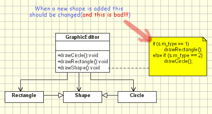

# [开闭原则](https://www.oodesign.com/open-close-principle.html) #
<!-- # Open Close Principle # -->

## 动机 ##
<!-- ## Motivation ## -->

聪明的应用程序设计和代码编写部分应注意在应用程序的开发和维护阶段进行的频繁更改。通常，将新功能添加到应用程序时会涉及许多更改。因为假定现有代码已经过单元测试，并且已编写的代码中的更改可能以不想要的方式影响现有功能，所以应将现有代码中的这些更改最小化。
<!-- A clever application design and the code writing part should take care of the frequent changes that are done during the development and the maintaining phase of an application. Usually, many changes are involved when a new functionality is added to an application. Those changes in the existing code should be minimized, since it's assumed that the existing code is already unit tested and changes in already written code might affect the existing functionality in an unwanted manner. -->

**开闭原则**规定，设计和代码写作应该以一种新的功能应与现有的代码最小的变化被添加来完成。设计应以允许将新功能作为新类添加的方式进行，并尽可能使现有代码保持不变。
<!-- The ***Open Close Principle*** states that the design and writing of the code should be done in a way that new functionality should be added with minimum changes in the existing code. The design should be done in a way to allow the adding of new functionality as new classes, keeping as much as possible existing code unchanged. -->

## 意图 ##
<!-- ## Intent ## -->

类，模块和函数之类的软件实体应**开放扩展**，但应**关闭修改**。
<!-- Software entities like classes, modules and functions should be **open for extension** but **closed for modifications**. -->

## 例子 ##
<!-- ## Example ## -->

以下是违反开闭原则的一个例子。它实现了一个图形编辑器，可以处理不同形状的图形。显然，它不遵循开闭原则原理，因为必须为每个添加的新形状类修改GraphicEditor类。有几个缺点：
<!-- Below is an example which violates the Open Close Principle. It implements a graphic editor which handles the drawing of different shapes. It's obviously that it does not follow the Open Close Principle since the GraphicEditor class has to be modified for every new shape class that has to be added. There are several disadvantages: -->

> * 对于添加的每个新形状，应重做GraphicEditor的单元测试。
> * 当添加一种新形状时，添加形状的时间会很长，因为添加形状的开发人员应该了解GraphicEditor的逻辑。
> * 即使新形状完美工作，添加新形状也可能以不希望的方式影响现有功能

<!-- 
> * for each new shape added the unit testing of the GraphicEditor should be redone.
> * when a new type of shape is added the time for adding it will be high since the developer who add it should understand the logic of the GraphicEditor.
> * adding a new shape might affect the existing functionality in an undesired way, even if the new shape works perfectly -->

为了产生更大的效果，可以想象一下，Graphic Editor是一个大类，其中包含许多开发人员编写和更改的许多功能，而形状可能是仅由一个开发人员实现的类。在这种情况下，允许在不更改GraphicEditor类的情况下添加新形状将是一个很大的改进。
<!-- In order to have more dramatic effect, just imagine that the Graphic Editor is a big class, with a lot of functionality inside, written and changed by many developers, while the shape might be a class implemented only by one developer. In this case it would be great improvement to allow the adding of a new shape without changing the GraphicEditor class. -->



```java
// 开闭原则-错误的示例
// Open-Close Principle - Bad example
 class GraphicEditor {
 
 	public void drawShape(Shape s) {
 		if (s.m_type==1)
 			drawRectangle(s);
 		else if (s.m_type==2)
 			drawCircle(s);
 	}
 	public void drawCircle(Circle r) {....}
 	public void drawRectangle(Rectangle r) {....}
 }
 
 class Shape {
 	int m_type;
 }
 
 class Rectangle extends Shape {
 	Rectangle() {
 		super.m_type=1;
 	}
 }
 
 class Circle extends Shape {
 	Circle() {
 		super.m_type=2;
 	}
 } 
 ```

以下是一个支持开闭原则的示例。在新设计中，我们将GraphicEditor中的抽象draw()方法用于绘制对象，同时在具体形状的对象中移动实现。使用开闭原则可以避免先前设计中的问题，因为在添加新的形状类时不会更改GraphicEditor：
<!-- Below is a example which supports the Open Close Principle. In the new design we use abstract draw() method in GraphicEditor for drawing objects, while moving the implementation in the concrete shape objects. Using the Open Close Principle the problems from the previous design are avoided, because GraphicEditor is not changed when a new shape class is added: -->

> * 无需单元测试。
> * 无需了解GraphicEditor的源代码。
> * 由于将绘图代码移至具体的形状类，因此添加新功能时降低影响旧功能的风险。

<!-- 
> * no unit testing required.
> * no need to understand the sourcecode from GraphicEditor.
> * since the drawing code is moved to the concrete shape classes, it's a reduced risk to affect old functionallity when new functionallity is added. -->
 
```java
Open Close Principle(OCP) - good
// 开闭原理-好的示例
// Open-Close Principle - Good example
 class GraphicEditor {
 	public void drawShape(Shape s) {
 		s.draw();
 	}
 }
 
 class Shape {
 	abstract void draw();
 }
 
 class Rectangle extends Shape  {
 	public void draw() {
 		// draw the rectangle
 	}
 } 
 ```

## 结论 ##
<!-- ## Conclusion ## -->

像每个原则一样，OCP只是一个原则。进行灵活的设计需要花费更多的时间和精力，并且引入了新的抽象级别，从而增加了代码的复杂性。因此，该原则应适用于最有可能更改的区域。
<!-- Like every principle OCP is only a principle. Making a flexible design involves additional time and effort spent for it and it introduce new level of abstraction increasing the complexity of the code. So this principle should be applied in those area which are most likely to be changed. -->

有许多设计模式可以帮助我们扩展代码而不进行更改。例如，装饰器模式可帮助我们遵循开闭原则。同样，工厂方法或观察者模式也可用于设计易于更改的应用程序，而只需对现有代码进行最少的更改即可。
<!-- There are many design patterns that help us to extend code without changing it. For instance the Decorator pattern help us to follow Open Close principle. Also the Factory Method or the Observer pattern might be used to design an application easy to change with minimum changes in the existing code. -->
